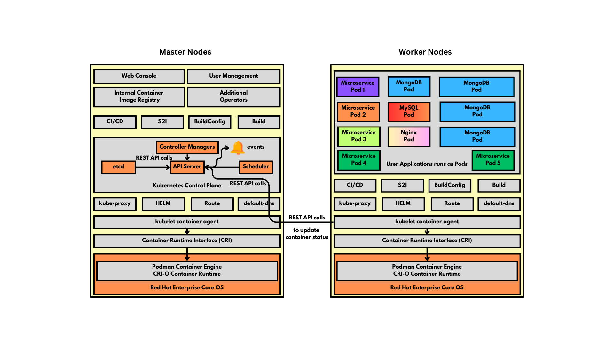

# Day 2

## Info - Container Orchestration Platform Overview
<pre>
- motivation to use Container Orchestration Platform
  - it offers every features that are required to make you application highly available (HA)
  - it has in-built monitoring tools, to check the health of your application, check if your application is live,
    check your application is ready to serve
  - it has provides performance metrics out of the box
  - it has features to check your application logs
  - it has features to scale up/down your application instances based on user-traffic either manually or automatically
  - it has features to upgrade/downgrade your application from one version to other without any downtime
  - it supports different deployment strategies
    - blue-green, A/B, canary kind of deployment strategies
  - it supports different types of services to make your application accessible within the container orchestration 
    platform or for external
  - some container orchestration platform they also offer CI/CD
  - self-healing
- in order to deploy an application into Container Orchestration Platform, they must be containerized first
  i.e you should have a container image that package your application and all its dependencies as a container images
- Container Orchestration Platform examples
  1. Docker SWARM
  2. Google Kubernetes
  3. Rancher
  4. Red Hat Openshift
  5. AWS eks ( Managed Kubernetes services from AWS )
  6. aks ( Managed Kubernetes service from Azure )
  7. ROSA ( Managed Red Hat Openshift from AWS )
  8. ARO ( Managed Red Hat Openshift from Azure )
</pre>

## Info - Docker SWARM
<pre>
- is a native container orchestration platform developed by Docker Inc organization
- it is an opensource product
- ideal for learning and POC
- ideal setup for Dev/QA
- easy to learn and easy to setup
- lightweight 
- but not production-grade
</pre>

## Info - Google Kubernetes
<pre>
- Google developed internally as borg 
- borg container orchestration was used within Google on several complex projects
- later, google refactored/refined it and made it as a better container orchestration platform called Kubernetes
- Google donated the Kubernetes as a opensource project
- it works as a cluster of many machines( called nodes )
- the nodes can be 
  - Physical Server
  - Virtual Machines running on a on-prem server
  - ec2 instance from AWS
  - azure vm from azure
- there are two types of nodes
  1. Master Node ( Any Linux distribution can be installed - Ubuntu, Fedora, RHEL, etc )
     - Control Plane Components runs only on Master node
       1. API Server (Pod)
       2. etcd (Pod)
       3. Controller Managers (Pod)
       4. Scheduler (Pod)
  2. Worker Node ( Any Linux distribution an be installed - Ubuntu, Fedora, RHEL, etc )
     - this is where user application willing be running
- it is a command-line tool
- there is no professional Dashboard ( webconsole )
- Google Kubernetes provides adding your own custom resources and custom controllers to extend
  Kubernetes
- application must be packaged as a Container Image along with its dependencies in order to deploy
  into Kubernetes(k8s)
</pre>

## Info - Red Hat Openshift
<pre>
- it is Red Hat's distribution of Kubernetes
- it developed on top of opensource Google Kubernetes with many additional useful features
- it is Kubernetes with batteries included
- Openshift newly added features on top of Kubernetes
  - Professional production-grade Webconsole
  - comes with Internal Container Registry
  - uses its own proprietary linux OS (Red Hat Enterprise Core OS) in master and worker nodes
  - uses its own proprietary Container Runtime(CRI-O) and Container Engine (Podman)
  - User Management ( Role Based Access Control[RBAC] )
  - Route ( can be used to expose your application for external access )
  - Project ( based on K8s Namespace with addition security policies applied on project level )
  - S2I ( Source to Image - application can be deployed into Openshift from Source Code )
- Red Hat Openshift 3.x supported docker as the default container engine
- Starting from Red Hat Openshift 4.x, they removed support for docker, instead it got replaced with Podman & CRI-O
- Starting from Red Hat Openshift 4.x, master nodes only supports Red Hat Enterprise Core OS (RHCOS) as the Operating System 
- Starting from Red Hat Openshift 4.x, worker nodes can choose between RHEL or RHCOS
- Red Hat acquired a company named CoreOS that had 2 interesting products
  1. CoreOS Operating System (minimal linux that is secured, has everything Container Orchestration Platform requires )
  2. rkt ( pronounced as Rocket Container Runtime )
  3. Network Fabric called flannel
- it also comes with world-wide support from Red Hat ( an IBM company )
</pre>


## Info - Kubernetes High Level Architecture


## Info - Red Hat Openshift High Level Architecture



## Info - Pod
<pre>
- Pod - literal english meaning is group of whales
- From K8s/Openshift point of view, Pod is a group of related containers
- every Pod has atleast 2 containers
  - one will the application container
  - the other will be secret infra hidden container called pause container
  - pause container provides network to your application container
- as a best practice, each Pod must have only one main application
- for instance
  - a Pod can weblogic as the main application
  - another Pod can mysql as the main application
- What is not recommended best practice for Pod 
  - we should not create a Pod that runs weblogic in one container and mysql in another container
- Unlike Docker, in Kubernetes/Openshift, IP address is assigned on the Pod level
- all the containers that are part of a single Pod, shares the same IP address
- applications will running inside one of the Pod Container
</pre>

## Info - ReplicaSet Controller
<pre>
- is responsible to create and manage the requested number of Pods in a stateless application deployment
- this ensure always 3 Pods will be running in your cluster
- if any Pod crashes, the ReplicaSet Controller find detect and fix it
</pre>

## Info - Types of applications supported by Kubernetes/Openshift Container Orchestration Platform
<pre>
1. Stateless applications (Deployment)
2. Stateful applications (StatefulSet)
3. Application that runs one time and stops once the work is completed (Job)
4. Recurring Tasks (CronJob)
5. Applications that must run one instance per Node within Kubernetes/Openshift cluster (DaemonSet)
</pre>

## Info - Stateless Application
<pre>
- let's say we deploy 3 Pods of a specific application
- the individual Pod may or may not use database as per the application design
- but each end-user call if is treated as fresh call, the application doesn't recognize the user, it is a stateless application
- example
  - google search
</pre>

## Info - Statefull application
<pre>
- generally all the Pods that are part of a single stateful application communicates with each
- they run as a cluster, ie. any data updated into one Pod gets syncrhonized on other Pods automatically
- a cluster of db instance is a good example of stateful application
- scale up/down statefull application are technically more complex compared to scale up/down of stateless application
</pre>


## Lab - Listing all nodes in our Openshift cluster
```
oc get nodes
kubectl get nodes

oc get nodes -o wide
kubectl get nodes -o wide
```

## Info - How Kuberentes or Openshift is able to connect with Kubernetes/Openshift cluster
<pre>
- the oc/kubectl client tools locates the kubeconfig file from your home directory i.e /home/palmeto/.kube/config
- first oc/kubectl will look for a environment variable called export KUBECONFIG=/home/palmeto/project1/myconfig, in this case it will 
  use
- each kubectl/oc command can use --kubeconfig switch to point to a kubeconfig file
  the myconfig file from my home directory
</pre>

## Info - Finding more details about your node
```
oc describe node/master01.ocp4.palmeto.org
oc describe node/master02.ocp4.palmeto.org
oc describe node/master03.ocp4.palmeto.org
oc describe node/worker01.ocp4.palmeto.org
oc describe node/worker02.ocp4.palmeto.org
oc describe node/worker03.ocp4.palmeto.org
```

## Lab - Getting used to Openshift projects

Listing all projects
```
oc get projects
oc get project
oc get namespaces
oc get namespace
oc get ns
kubectl get namespaces
```

Creating new project
```
oc new-project jegan
```

Switching between projects
```
oc project default
oc project jegan
```

Finding currently active project
```
oc project
```

## Lab - Deploying your first stateless application into Openshift under your project
```
oc project jegan
oc get imagestreams -n openshift | grep nginx
oc create deploy nginx --image=image-registry.openshift-image-registry.svc:5000/openshift/bitnami-nginx:1.26 --replicas=3
```

Listing all deployments in your project
```
oc get deployments
oc get deployment
oc get deploy
```

Listing all replicasets
```
oc get replicasets
oc get replicaset
oc get rs
```

Listing all pods
```
oc get pods
oc get pod
oc get po
```

Listing many resources with single command
```
oc get all
oc get deploy,rs,po
```

Finding the IP address of the pods
```
oc get pods -o wide
```

Checking pods logs
```
oc logs nginx-dbfb56c96-6lqrh
```

Describing a deployment to find detailed meta-data about your application deployment
```
oc describe deploy/nginx
```

Describing a replicaset to find detailed meta-data bout your replicaset
```
oc describe rs/nginx-dbfb56c96
```

Describing a pod to get detailed pod info
```
oc describe pod/nginx-dbfb56c96-6lqrh
```

## Lab - Getting inside a pod shell
```
oc rsh deploy/nginx
hostname
hostname -i
ls
exit

oc rsh pod/nginx-6cffbd84c5-kgnmz
hostname
hostname -i
ls
exit
```

## Lab - Pod forwarding for quick testing/debugging ( not for production )
```
# Terminal Tab 1
oc get pods
oc port-forward pod/nginx-6cffbd84c5-tj86t 9090:8080

# Terminal Tab 2
curl http://localhost:9090  # This works
curl http://127.0.0.1:9090  # This works
curl http://192.168.10.200:9090 # This will not work
```
