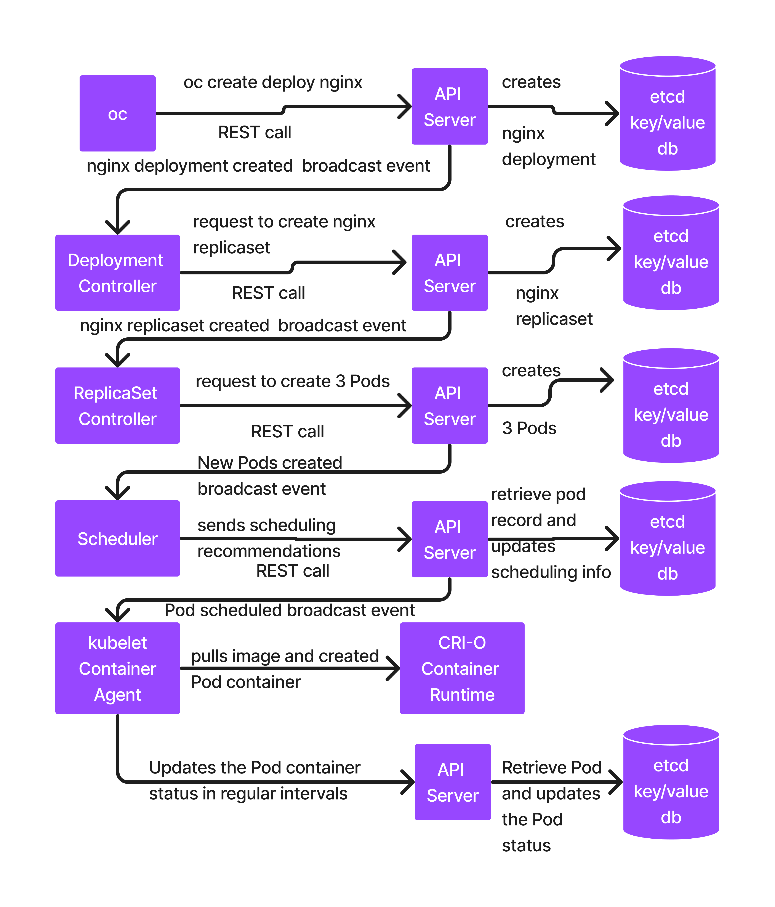

# Day 3

## Info - You can find Red Hat Base images here
<pre>
https://catalog.redhat.com/en/software/containers/explore
</pre>

## Info - You can find other Red Hat Openshift compatible images here
<pre>
https://catalog.redhat.com/en/search?searchType=Containers
</pre>  

## Info - API Server
<pre>
- is the heart of kubernetes/openshift
- anything and everything in Kubernetes/Openshift is co-ordinated by API server, hence this is
  one of the most critical components
- API server only performs database activities like
  - it creates a new record in etcd datastore
  - it updates an existing record in the etcd datastore
  - it retrieves an existing record from the etcd datastore
  - it deletes an existing record from the etcd datastore
  - everytime some new record are added, existing records updated, existing records deleted it will
    send events to registered controllers
</pre>

## Info - etcd
<pre>
- it is distributed database which stores data in key/value format
- it is an idendepent opensource project used by Kubernetes & openshift
- this can be used outside the scope of K8s/Openshift as well
</pre>

## Info - Scheduler
<pre>
- is a Pod
- is one of the Control Plane components that runs in the master node
- it is responsible to identify a healthy node where a new Pod can be deployed
- scheduler by itself can't deploy a pod into any node, it is allowed only to share it scheduling
  recommendations to API Server via REST call
</pre>

## Info - Controller Managers
<pre>
- the real doers are controllers
- is a collection of many in-built controllers
- for each type of resource supported in Openshift/Kubernetes there is one Controller
- For example
  - Deployment Controller manages Deployment resource ( stateless application )
  - ReplicaSet Controller manages ReplicaSet resource
  - Job Controller manages Job resource
  - StatefulSet Controller manages Statefult resource ( stateful application )
  - DaemonSet Controller manages DaemonSet resource
- Controller is a application that runs within a Pod container
- they have unrestricted access within the Kubernetes/Openshift cluster
- they can monitor specific type of resources created/updated/deleted under any project within the cluster
- they get notified by API Server via events
- Controllers if it needs to communicate something to API Server, it make a REST API call
</pre>

## Lab - Login to openshift from command-line
```
cat ~/openshift.txt
# Server 1
oc login --username=kubeadmin --password=7ygAQ-3ovES-yevQV-shmAD https://api.ocp4.palmeto.org:6443 --insecure-skip-tls-verify

# Server 2
oc login --username=kubeadmin --password=7ygAQ-3ovES-yevQV-shmAD https://api.ocp4.palmeto.org:6443 --insecure-skip-tls-verify
```

## Lab - Deploying your application in declarative style into Openshift
```
# Delete your existing project ( make sure it is your project )
oc delete project jegan

# Create new project
oc new-project jegan

# Auto-generate the declarative manifest script for nginx deployment
oc create deploy nginx --image=image-registry.openshift-image-registry.svc:5000/openshift/bitnami-nginx:1.26 --replicas=3 --dry-run=client -o yaml

oc create deploy nginx --image=image-registry.openshift-image-registry.svc:5000/openshift/bitnami-nginx:1.26 --replicas=3 --dry-run=client -o yaml > nginx-deploy.yml

# create command must be used only the first time
# because create will assume the nginx deploy doesn't exist already, if exists it reports error and stops there
# save-config will store the file name with which we created the resources in declarative style
# later when we make delta changes to yaml file and when we apply the changes it is going to validate are we using the same file
# that we originally used to create the set of resources
oc create -f nginx-deploy.yml --save-config=true

oc get deploy,rs,po
```

## Info - What happens internally when we run the below command
```
oc create deploy nginx --image=image-registry.openshift-image-registry.svc:5000/openshift/bitnami-nginx:1.26 --replicas=3
```


## Info - Kubernetes/Openshift Service
<pre>
- represents a group of load-balanced pods from a single deployment
- service has a unique name and IP address
- service can be accessed by its name or using its IP Address
- when a service is accessed using its name, the dns within Openshift supports service discovery (i.e translates service name to 
  service IP )
- kube-proxy that runs in every node provides inbuilt load-balancing within Kubernetes and Openshift
- there are 3 types of services supported in Kubernetes/Openshift
  1. ClusterIP Internal Service
  2. NodePort External Service
  3. LoadBalancer External Service
</pre>

## Lab - Creating an internal service for nginx deployment in declarative style
The practical use-case for internal service - database access should be restricted only with the Openshift cluster.
So pods running within the same openshift cluster can only access this type of service.
```
oc project jegan

oc get pods
oc expose deploy/nginx --type=ClusterIP --port=8080 --dry-run=client -o yaml
oc expose deploy/nginx --type=ClusterIP --port=8080 --dry-run=client -o yaml > nginx-clusterip-svc.yml

oc apply -f nginx-clusterip-svc.yml
oc get svc
oc describe svc/nginx
```

In order to test our nginx internal service, let's create a test pod with hello image
```
oc create deploy hello --image=image-registry.openshift-image-registry.svc:5000/openshift/hello:1.0
oc get pods

oc rsh pod/hello-65b55c7964-vwgv7
curl http://nginx:8080
exit
```

## Lab - Creating an external nodeport service for nginx deployment in declarative style
```
oc project jegan

oc get pods

# Delete existing clusterip service
oc delete -f nginx-clusterip-svc.yml

oc expose deploy/nginx --type=NodePort --port=8080 --dry-run=client -o yaml
oc expose deploy/nginx --type=NodePort --port=8080 --dry-run=client -o yaml > nginx-nodeport-svc.yml

oc apply -f nginx-nodeport-svc.yml
oc get svc
oc describe svc/nginx
```

Testing the nodeport service, the port 32053 is opened on all nodes
```
oc get nodes

curl http://master01.ocp4.palmeto.org:32053
curl http://master02.ocp4.palmeto.org:32053
curl http://master03.ocp4.palmeto.org:32053
curl http://worker01.ocp4.palmeto.org:32053
curl http://worker02.ocp4.palmeto.org:32053
curl http://worker03.ocp4.palmeto.org:32053
```

## Info - Persistent Volume (PV)
<pre>
- this is the external disk, Openshift administrators will be creating using NFS, NAS, SAN, S3 bucket, Longhorn, etc.,  
- Usually it has the below attributes
  - Size in MiB/GiB/TiB
  - Access Mode
    - ReadWriteOnce ( all pods from a single node can access this disk )
    - ReadWriteMany ( all pods from all nodes can access this disk )
  - StorageClass (optional)
    - is a way, the Persistent Volume can be dynamically provisioned
    - For instance, the Openshift Administrators can create a StorageClass for NFs, AWS S3 bucket, etc.,
    - Whenever some application is requesting for Persistent Volume of a particular type of Storageclass, if
      there is a corresponding storageclass it will automatically provision that Persistent Volume 
- created in the cluster scope, means any application running on any project namespace can claim and use it
</pre>

## Info - Persistent Volume Claim (PVC)
<pre>
- this is created by dev/qa/devops teams 
- this is project scoped, only applications within the same project can access the PVC
- the below attributes are expected in the PVC
  - Size in MiB/GiB/TiB
  - Access Mode
    - ReadWriteOnce ( all pods from a single node can access this disk )
    - ReadWriteMany ( all pods from all nodes can access this disk )
  - StorageClass
- Storage Controller, scans the Openshift cluster looking for a matching PV as per the attributes requested by PVC,
  if it finds one, it will let the PVC claim and use that PV
</pre>

## Lab - Deploying wordpress mysql multi-pod application that uses Persistent Volume and Claim

Clone the training repository
```
cd ~
git clone https://github.com/tektutor/openshift-2731july-2026.git
```

Deploying wordpress and mysql multi-pod application. Make sure you have replace 'jegan' with your linux user in 
mysql-pv.yml mysql-pvc.yml mysql-deploy.yml wordpress-pv.yml wordpress-pvc.yml wordpress-deploy.yml

And update the NFS Server IP to 192.168.10.201 in case you are working in server2
```
oc project jegan

cd Day3/wordpress-with-configmaps-and-secrets
./deploy.sh

oc get pods
oc get pv,pvc
oc get svc
oc get route
```

Using the route url, from lab machine web browser you can access the wordpress blog page.


## Info - Helm
<pre>
- is a package manager for Kubernetes and Openshift Container Orchestration Platform
- when you deploy an application in declarative style, we end up writing multiple yaml manifest scripts
- those Openshift manifest scripts must be applied following a particular sequence while deploying, while
  undeploying we need to follow reverse order, otherwise it takes several attempts before you can successfully
  deploy/undeploy your application and you will end wasting lot of debug time
- Helm package manager, relieves us from this problem
- Helm package manager is a tool created for Kubernetes & Openshift, hence it know all the resource types
  supported by Kubernetes and Openshift
- Helm also know what is the sequence resources must be created while deploying applications, also it knows
  in which order resources must be deleted while undeploying the applicaiton
- Our applications can be packaged as Helm charts to deploy them into Kubernetes/Openshift
- Using the Helm chart one can deploy the application without worrying about the sequence or internal complications
- Helm takes care of all the dependencies and it follow the correct order while deploying/un-deploying applications
</pre>

## Lab - Packaging wordpress, mysql multipod application as helm chart and deploying into Openshift
```
cd ~
mkdir -p wordress-helm-chart/scripts
cd wordpress-helm-chart/scripts
cp -R ~/openshift-2731july-2026/Day3/wordpress-with-configmaps-and-secret .
cd ..

helm create wordpress
cd wordpress/templates
rm -rf *
cp ../../scripts/* .
cd ../..
echo "" > values.yaml
cd ..

helm package wordpress

ls -l

oc new-project jegan
helm install wordpress wordpress-0.1.0.tgz

helm list

oc get pods
oc get svc
oc get pv,pvc
oc get route
```

From your lab machine web browser, you may access wordpress now
```
http://wordpress-jegan.apps.ocp4.palmeto.org/
```

Once you are done with this exercise, you may uninstall wordpress using helm
```
helm list
helm uninstall wordpress

oc get deploy,rs,po,pv,pvc,svc,route, configmaps, secrets
```
