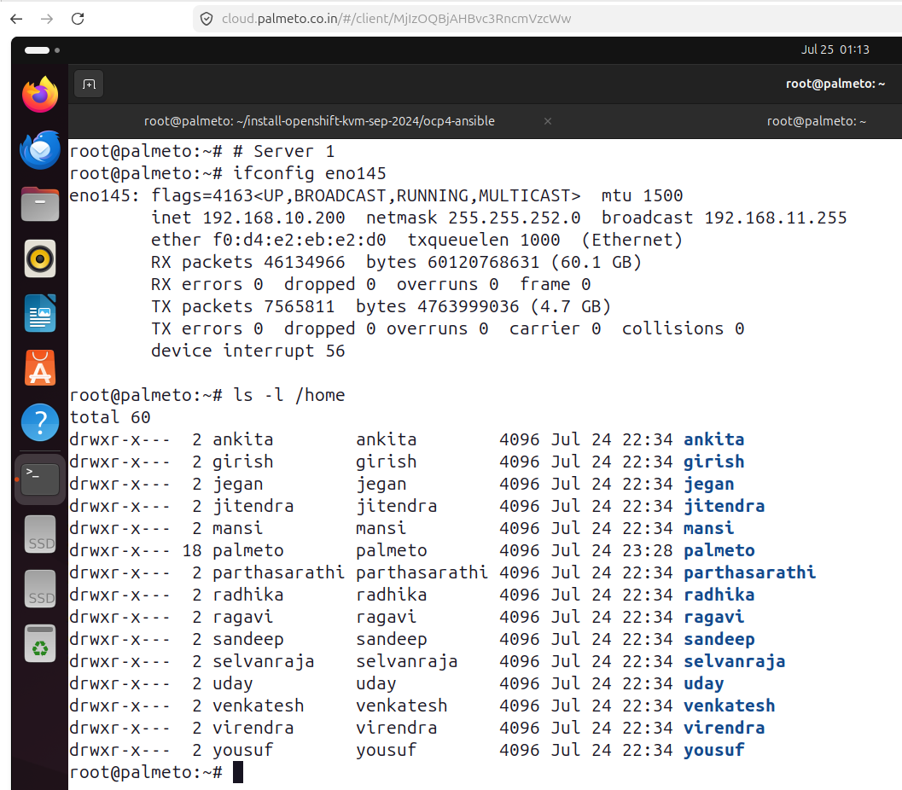
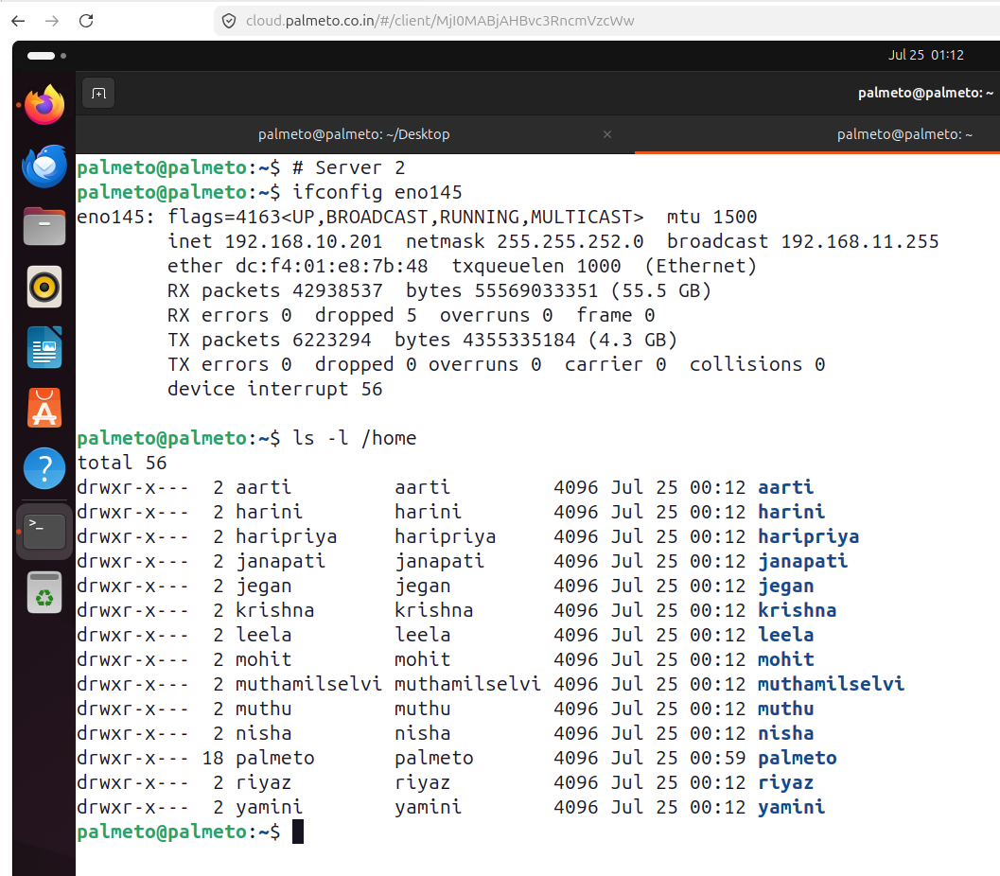

# openshift-2731july-2026

## Pre-test link
<pre>
https://forms.cloud.microsoft/r/Mrgt95bg0Q  
</pre>  

## About about lab environment
<pre>
We have got two servers with below configurations
- Dell PowerEdge R840 Server
- Intel Xeon Processor with 192 CPU Cores
- 1 TB RAM
- 21 TB SSD
</pre>

## Linux Login Credentials
<pre>
username - yourname
password - palmeto@123
</pre>

#### Server 1 (192.168.10.200)


#### Server 2 (192.168.10.201)


## Lab - Getting used to Openshift projects

Listing all projects
```
oc get projects
oc get project
oc get namespaces
oc get namespace
oc get ns
kubectl get namespaces
```

Creating new project
```
oc new-project jegan
```

Switching between projects
```
oc project default
oc project jegan
```

Finding currently active project
```
oc project
```

## Lab - Deploying your first stateless application into Openshift under your project
```
oc project jegan
oc get imagestreams -n openshift | grep nginx
oc create deploy nginx --image=image-registry.openshift-image-registry.svc:5000/openshift/bitnami-nginx:1.26 --replicas=3
```

Listing all deployments in your project
```
oc get deployments
oc get deployment
oc get deploy
```

Listing all replicasets
```
oc get replicasets
oc get replicaset
oc get rs
```

Listing all pods
```
oc get pods
oc get pod
oc get po
```

Listing many resources with single command
```
oc get all
oc get deploy,rs,po
```

Finding the IP address of the pods
```
oc get pods -o wide
```

Checking pods logs
```
oc logs nginx-dbfb56c96-6lqrh
```

Describing a deployment to find detailed meta-data about your application deployment
```
oc describe deploy/nginx
```

Describing a replicaset to find detailed meta-data bout your replicaset
```
oc describe rs/nginx-dbfb56c96
```

Describing a pod to get detailed pod info
```
oc describe pod/nginx-dbfb56c96-6lqrh
```

